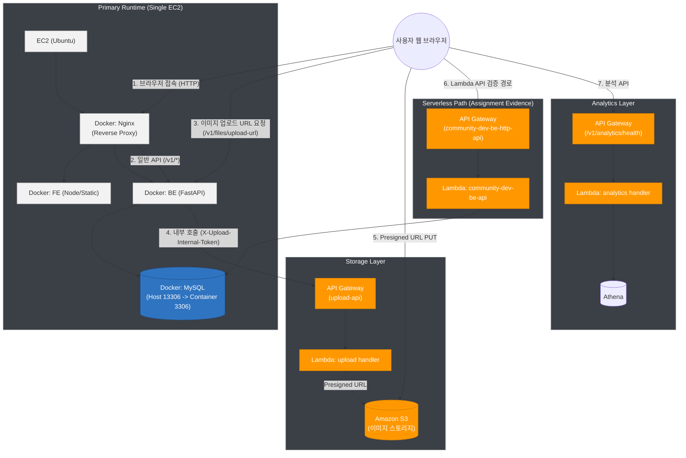
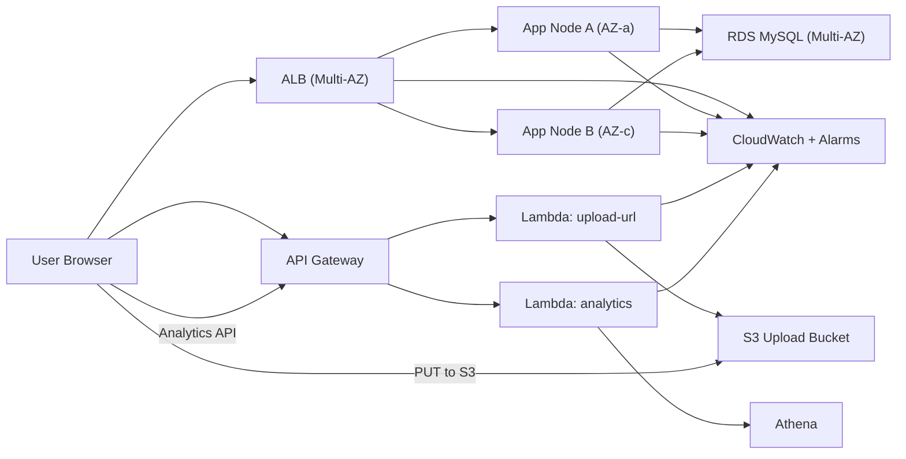

# 커뮤니티 프로젝트 보고서 초안 (노션 제출용)

최종 업데이트: 2026-03-04 (KST)

## 0. 문서 목적

- 본 문서는 커뮤니티 프로젝트의 현재 운영 구조(As-Is)와 고가용성 목표 구조(To-Be)를 비교해 정리한다.
- 범위는 인프라/안정성 설계 중심이며, 기능 설명은 최소화한다.

## 1. 시스템 아키텍처 설계도

### 1.1 As-Is (현재)

- 클라이언트: Browser
- 운영 기본 경로: 단일 EC2 Reverse Proxy
  - Nginx + FE + BE + MySQL Docker Compose
- BE Lambda 경로: 과제 증빙용으로 유지
  - API Gateway(`community-dev-be-http-api`) -> Lambda(`community-dev-be-api`)
  - Lambda DB 연동: EC2 MySQL(`10.20.27.37:13306`)
- 파일 업로드:
  - 기본: FE -> BE(`/v1/files/upload-url`, 인증) -> API Gateway -> Lambda -> S3 (Presigned URL)
  - 폴백: BE `/v1/files/upload`
- 부가 서비스:
  - API Gateway + Lambda(analytics, upload)
  - CloudWatch/CloudTrail/EFS
- 비용 통제 운영:
  - 평시에는 EC2 stop, 검증/배포 시에만 start

### 1.2 To-Be (목표)

- 다중 AZ + ALB + Auto Scaling Group(EC2) 또는 ECS 서비스 이중화
- DB: RDS Multi-AZ + 자동 백업 + 스냅샷 정책
- 업로드: API Gateway + Lambda + S3 단일 경로로 표준화
- 관측: CloudWatch 대시보드/알람 + 중앙 로그

### 1.3 서비스 흐름

1. 사용자 요청 -> Nginx(80) -> FE 정적 파일 응답
2. API 요청 -> Nginx 리버스 프록시 -> BE API
3. 이미지 업로드:
   - FE -> BE(`/v1/files/upload-url`, 인증 필요) -> API Gateway -> Lambda -> S3 Presigned URL
   - FE -> S3 직접 PUT
   - API Gateway 직접 호출(내부 토큰 없음)은 401 차단
4. 분석 호출:
   - FE/운영도구 -> API Gateway(`/v1/analytics/health`) -> Lambda -> Athena
5. Lambda BE 검증 경로:
   - API Gateway(`/`) -> Lambda(`community-dev-be-api`) -> EC2 MySQL(13306)

### 1.4 사용 기술 스택

| 영역 | 사용 기술/서비스 | 역할 |
|---|---|---|
| Frontend | HTML/CSS/JavaScript, Node.js | 웹 UI 제공, API 호출 |
| Backend | FastAPI, Uvicorn, Python | 인증/게시글/댓글/좋아요/업로드 API |
| Reverse Proxy | Nginx (Docker) | FE 정적 서빙, `/v1/*` 백엔드 라우팅 |
| Database | MySQL 8 (Docker) | 사용자/게시글/댓글/세션 데이터 저장 |
| Container | Docker, Docker Compose | 로컬/EC2 서비스 통합 배포 |
| Image Registry | Docker Hub, ECR, Local Registry(Portainer 실습) | 컨테이너 이미지 저장/배포 |
| Serverless | API Gateway, Lambda, S3, Athena | 업로드 presigned URL, 분석 API, BE Lambda 증빙 |
| IaC/배포 | Terraform, GitHub Actions, AWS SSM | 인프라 구성/CI/CD/원격 배포 |
| Observability | CloudWatch, CloudTrail | 로그/알람/감사 추적 |

## 2. 예상 트래픽 기반 장애 시나리오

### 2.1 가정

- 이벤트성 트래픽 급증으로 평시 대비 5~10배 요청 증가
- 읽기 요청(게시글/댓글)이 쓰기 요청보다 훨씬 많음

### 2.2 병목 후보

1. DB 커넥션 고갈
2. BE 컨테이너 CPU/메모리 포화
3. 단일 EC2 네트워크 대역폭 한계
4. 이미지 업로드 시 API/Lambda timeout

### 2.3 장애 전파

1. DB 지연 -> BE 응답 지연/타임아웃
2. BE 지연 -> FE 사용자 체감 장애 확산
3. 인증 API 지연 -> 전체 보호 API 사용 불가

### 2.4 영향 범위 및 전파 구조

| 시작 장애 지점 | 1차 영향 | 2차 전파 | 사용자 영향 |
|---|---|---|---|
| MySQL 연결 지연/다운 | 게시글/댓글/인증 API 실패 증가 | Nginx upstream 대기 증가, Lambda DB 의존 API 실패 | 로그인 실패, 피드 로딩 지연/오류 |
| BE 컨테이너 CPU 포화 | 응답 시간 증가(5xx/timeout) | FE 재시도 증가로 추가 부하 유발 | 화면 갱신 실패, UX 급격 악화 |
| 단일 EC2 네트워크 이슈 | FE+BE+DB 동시 영향 | Lambda DB 연동 경로도 간접 장애 | 서비스 전체 가용성 저하 |
| 업로드 Lambda/API Gateway 지연 | presigned URL 발급 실패 | FE 폴백 업로드 경로 부하 증가 | 이미지 업로드 실패율 상승 |

## 3. 고가용성 구현 방안 (AWS 중심)

### 3.1 AZ 분산

- 퍼블릭/프라이빗 서브넷을 2개 AZ에 분산
- BE 워크로드를 최소 2개 인스턴스로 운영

### 3.2 트래픽 분산

- ALB를 단일 진입점으로 사용
- 헬스체크 실패 인스턴스 자동 제외

### 3.3 데이터 이중화/백업

- RDS Multi-AZ + 자동 백업
- S3 버전닝 + 라이프사이클
- 주기적 스냅샷 및 복구 리허설

### 3.4 복구 전략

- RTO 목표: 30분 이내
- RPO 목표: 5분 이내(트랜잭션/백업 정책 기준)
- 롤백:
  - EC2: 이전 이미지 태그 재배포
  - ECS: 이전 task definition 롤백
  - Lambda: alias 이전 버전 롤백

### 3.5 RTO/RPO 기준 복구 절차

1. 감지: CloudWatch 알람으로 장애 징후 확인(응답시간/5xx/CPU).
2. 격리: 장애 인스턴스 트래픽 차단(ALB 헬스체크 실패 기준).
3. 복구:
   - 애플리케이션: 이전 정상 이미지 태그로 즉시 롤백
   - 데이터: RDS 스냅샷/자동백업 기반 복구
4. 검증: 핵심 API(`login`, `posts list`, `upload-url`) 스모크 테스트 수행
5. 사후 조치: 원인 분석(RCA), 재발 방지 액션 및 임계치 조정

## 4. 과제별 실행 증빙 링크

### 4.1 과제 8 (CI/CD + ECS/Lambda 배포 경험)

- CI 성공: `https://github.com/hahark-ops/2-junsu-community-be/actions/runs/22476517881`
- EC2 자동배포 성공: `https://github.com/hahark-ops/2-junsu-community-be/actions/runs/22476551001`
- Lambda 배포 성공: `https://github.com/hahark-ops/2-junsu-community-be/actions/runs/22469395475`
- ECS 배포 성공: `https://github.com/hahark-ops/2-junsu-community-be/actions/runs/22469758970`

### 4.2 과제 9 (Terraform destroy/apply)

- 로컬 증빙 폴더:
  - `/Users/junsu/Desktop/2-junsu-community-be/evidence/assignment9-20260301-204358`
- 핵심 로그:
  - `11-destroy-final.txt`
  - `20-apply-final.txt`
  - `21-output-after.txt`
  - `22-state-after-apply.txt`

### 4.3 과제 10/11 증빙 (2026-03-04 기준)

- 과제 10 (테스트코드 -> CI 게이트)
  - CI 성공 run(기본 기능 테스트 통과): `https://github.com/hahark-ops/2-junsu-community-be/actions/runs/22544670598`
  - CI 실패 run(의도적 게이트 검증): `https://github.com/hahark-ops/2-junsu-community-be/actions/runs/22544406601`
  - 실패 SHA(`9d03e4f...`)에서는 `deploy-ec2` 미트리거 확인
  - 결론: "테스트 실패 시 배포 차단" 정책이 정상 동작함
- 과제 11 (GitHub Actions -> EC2 자동배포)
  - CI 성공 run: `https://github.com/hahark-ops/2-junsu-community-be/actions/runs/22544670598`
  - 배포 성공 run: `https://github.com/hahark-ops/2-junsu-community-be/actions/runs/22544690983`
  - EC2 내부 헬스: `curl http://127.0.0.1/` -> `HTTP/1.1 200 OK`
  - 추가 운영 정책 검증:
    - EC2가 `stopped` 상태면 `deploy-ec2`는 자동 기동 없이 실패 처리(비용 통제 목적)
    - 의도: push 자동배포 유지 + 인스턴스 수동 기동 시에만 실제 배포 허용

### 4.4 최신 수동 배포 검증 (2026-03-04)

- 배포 커밋/태그:
  - commit: `1907f3e`
  - 이미지 태그: `sha-1907f3e`
- EC2 수동 배포 검증 결과:
  - `curl http://127.0.0.1/` -> `200`
  - `curl http://127.0.0.1/docs` -> `200`
  - 이후 비용 통제를 위해 BE EC2 `stop` 적용

### 4.5 과제 6 최신 상태 (2026-03-03)

- Lambda BE API 재배포 및 DB 연동 복구
  - `/` -> `200`
  - `/docs` -> `200`
  - `/v1/auth/me` (비로그인) -> `401`
  - `/v1/posts?limit=1&offset=0` -> `200`

## 5. 운영상 한계와 다음 단계

### 5.1 현재 한계

1. 단일 EC2 경로는 장애 내성이 낮음
2. 컨테이너 DB는 운영 안정성이 낮아 장기 운영 부적합
3. 비용 통제를 위해 상시 운영을 제한 중
4. EC2 stop 시 Lambda의 DB 의존 API도 동작 불가(현재 DB가 EC2 내부이므로)

### 5.2 다음 단계

1. 과제 12: Jenkins 연동(EC2 Jenkins 또는 GitHub Actions + Jenkins 혼합)
2. CI/CD 운영 분기 정리(main/prod, develop/dev)
3. 비용 최소화 운영(run 후 stop 자동화)
