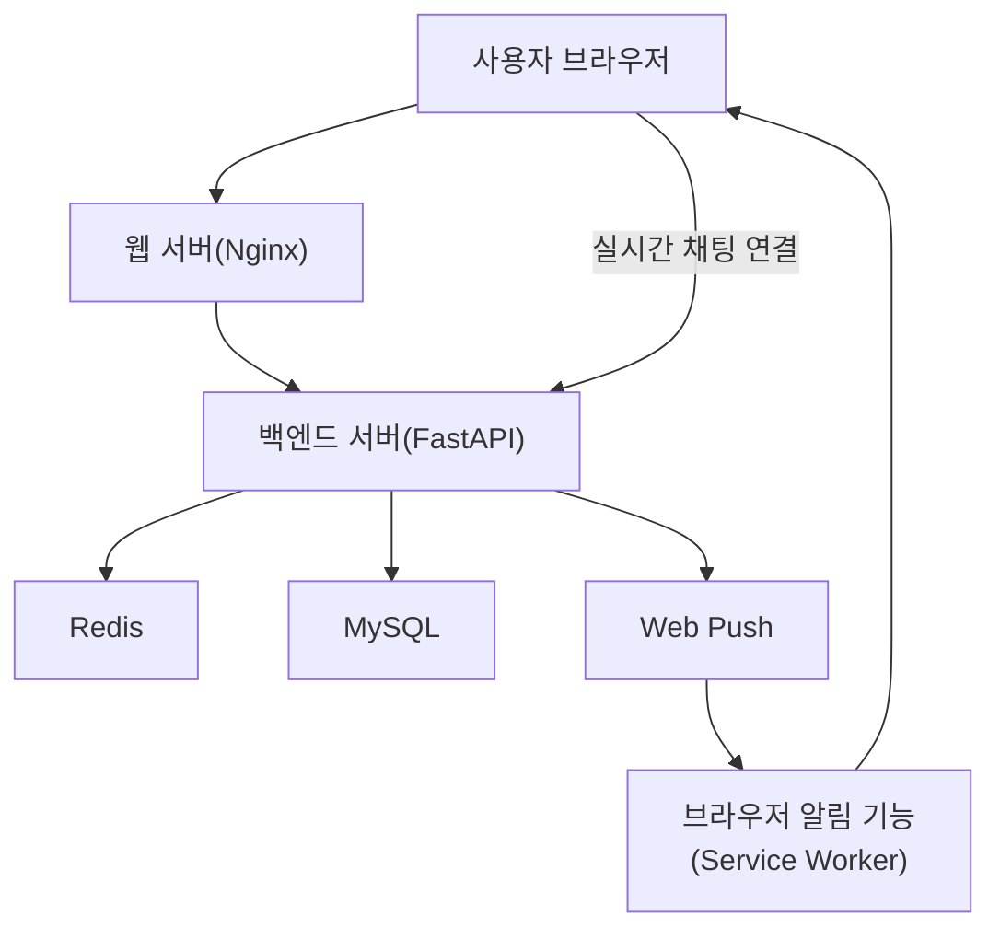

# 커뮤니티 프로젝트 쉬운 설명 보고서

최종 업데이트: 2026-03-12 (KST)

## 1. 이 프로젝트는 무엇인가

이 프로젝트는 게시글, 댓글, 좋아요, 이미지 업로드, 그리고 실시간 1:1 메시지 기능이 있는 커뮤니티 서비스입니다.

쉽게 말하면:
- 글을 올리고
- 댓글로 대화하고
- 이미지도 올릴 수 있고
- 따로 1:1 DM도 보낼 수 있는 서비스입니다.

## 2. 이번에 해결한 핵심 문제

실시간 DM은 단순히 메시지를 보내는 것만으로 끝나지 않습니다.

문제는 2가지였습니다.

1. 서버가 한 대가 아니라 여러 대여도 메시지가 바로 전달되어야 함
2. 상대방이 그 채팅방을 보고 있지 않을 때는 브라우저 알림이 가야 함

이 두 가지를 해결하지 않으면 “실시간 채팅”이라고 보기 어렵습니다.

## 3. 어떻게 해결했는가

### 3.1 실시간 채팅

- 브라우저는 서버와 WebSocket으로 계속 연결되어 있습니다.
- 사용자가 메시지를 보내면 서버는 먼저 DB에 저장합니다.
- 그 다음 Redis를 통해 “새 메시지가 생겼다”는 이벤트를 다른 서버들에게도 전달합니다.

즉, 서버가 여러 대여도 같은 채팅방의 상대방에게 바로 메시지를 보낼 수 있습니다.

### 3.2 상대가 부재 중일 때 알림

- 상대방이 지금 그 DM 방 WebSocket에 연결되어 있는지 Redis presence로 확인합니다.
- 만약 해당 방에 연결되어 있지 않으면, 브라우저의 Service Worker를 이용해 Web Push 알림을 보냅니다.

쉽게 말하면:
- 채팅창에 연결돼 있으면 실시간으로 화면에 보이고
- 해당 채팅방에 연결돼 있지 않으면 브라우저 알림이 갑니다.

## 4. 시스템이 어떻게 움직이는가

## 5. Redis가 왜 필요한가

서버가 한 대면 간단합니다.  
하지만 서버가 두 대 이상이면 문제가 생깁니다.

예를 들어:
- A 사용자는 서버 1에 연결
- B 사용자는 서버 2에 연결

이때 A가 메시지를 보냈을 때 서버 1만 알고 있으면, 서버 2에 붙어 있는 B에게 바로 전달할 수 없습니다.

그래서 Redis가 필요합니다.

Redis는 “새 메시지가 생겼다”는 신호를 서버들 사이에서 전달해 주는 역할을 합니다.

즉:
- MySQL은 메시지를 저장하는 곳
- Redis는 서버들끼리 실시간 소식을 전달하는 곳

## 6. 지금 어디까지 구현됐는가

현재 구현된 내용은 다음과 같습니다.

- 게시글/댓글/좋아요
- 이미지 업로드
- 실시간 1:1 DM
- 읽음 표시 / 미읽음 표시
- 서버가 여러 개여도 DM이 전달되는 구조
- 상대가 채팅방에 없을 때 브라우저 알림

즉, 단순한 게시판을 넘어 “실시간 대화가 가능한 커뮤니티” 수준까지 확장한 상태입니다.

## 7. 앞으로 더 확장할 수 있는 기능

아직 남아 있는 확장 아이디어는 다음과 같습니다.

- 읽음 시간 표시
- 파일/이미지 DM 전송
- 모바일 푸시 알림
- 차단 기능
- 입력 중 표시

즉 지금은 핵심 기능을 먼저 완성했고, 이후에는 사용자 경험을 더 고도화하는 방향으로 확장할 수 있습니다.
