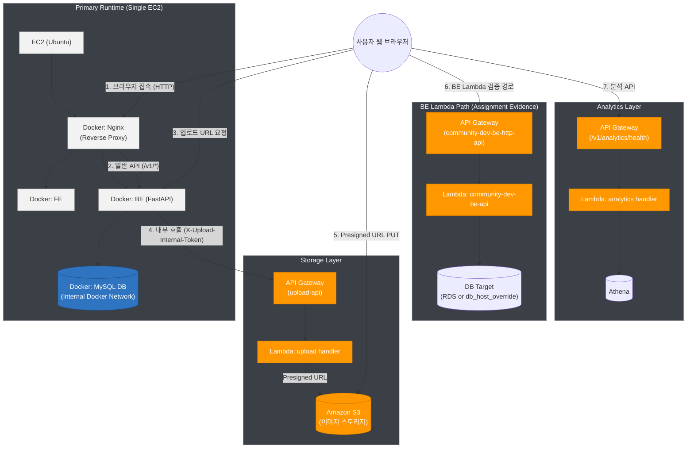
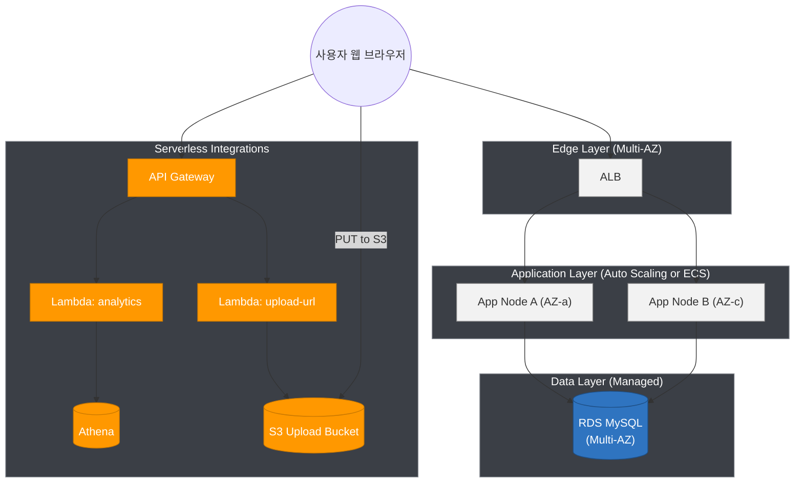

# 시스템 아키텍처 설계도 (노션 붙여넣기용)

최종 업데이트: 2026-03-09 (KST)

## As-Is (현재 운영)

## To-Be (고가용성 목표)

## 서비스 흐름 요약

1. 사용자 요청은 Nginx(현재) 또는 ALB(목표)로 진입한다.
2. 일반 API는 애플리케이션 컨테이너(FastAPI)로 라우팅된다.
3. 업로드는 BE(`/v1/files/upload-url`)가 API Gateway -> Lambda로 presigned URL을 발급받고, 브라우저가 그 URL로 S3에 직접 업로드한다.
   - 브라우저가 API Gateway upload 경로를 직접 호출하는 것은 내부 토큰 검증으로 차단된다.
4. 분석 API는 API Gateway -> Lambda -> Athena 경로로 처리한다.
5. BE Lambda 경로는 API Gateway -> Lambda -> 별도 DB 대상(RDS 또는 `db_host_override`)으로 연결된다.
